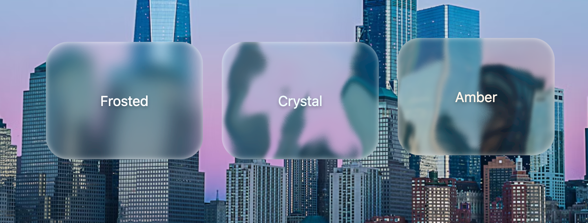

# Solid Glass

A lightweight, customizable solid glass effect library for modern web applications. Create Apple-like glass effects with dynamic distortion, customizable tints, and smooth animations.



🚀 **[Live Demo](https://iplanwebsites.github.io/solid-glass/)**

## Features

- 🎨 **Fully Customizable**: Control every aspect of the glass effect
- 🚀 **Lightweight**: Minimal dependencies, optimized performance
- 🔧 **Framework Agnostic**: Works with vanilla JS, React, and Vue
- 🌈 **Dynamic Effects**: Real-time noise distortion and frost effects

## Installation

```bash
npm install solid-glass
```

Or with yarn:

```bash
yarn add solid-glass
```

## Quick Start

### Vanilla JavaScript

```javascript
import { SolidGlass } from "solid-glass";
import "solid-glass/style.css";

const element = document.getElementById("my-glass-element");
const glass = new SolidGlass(element, {
  tintColor: "255, 255, 255",
  tintOpacity: 0.05,
  frostBlur: 10,
  noiseFrequency: 0.01,
  distortionStrength: 80,
});
```

### React

```jsx
import { SolidGlassReact } from "solid-glass/react";
import "solid-glass/style.css";

function App() {
  return (
    <SolidGlassReact
      width="400px"
      height="300px"
      tintColor="#ffffff"
      tintOpacity={0.05}
      frostBlur={10}
    >
      <h1>Your Content Here</h1>
    </SolidGlassReact>
  );
}
```

### Vue

```vue
<template>
  <SolidGlass
    :tint-color="'#ffffff'"
    :tint-opacity="0.05"
    :frost-blur="10"
    width="400px"
    height="300px"
  >
    <h1>Your Content Here</h1>
  </SolidGlass>
</template>

<script>
import { SolidGlassVue } from "solid-glass/vue";
import "solid-glass/style.css";

export default {
  components: {
    SolidGlass: SolidGlassVue,
  },
};
</script>
```

## API Reference

### Options

| Property             | Type   | Default                      | Description                    |
| -------------------- | ------ | ---------------------------- | ------------------------------ |
| `shadowColor`        | string | `'rgba(255, 255, 255, 0.7)'` | Inner shadow color             |
| `shadowBlur`         | number | `7`                          | Shadow blur radius in pixels   |
| `shadowSpread`       | number | `0`                          | Shadow spread radius in pixels |
| `shadowOffset`       | number | `0`                          | Shadow offset                  |
| `tintColor`          | string | `'255, 255, 255'`            | Glass tint color (RGB format)  |
| `tintOpacity`        | number | `0.04`                       | Glass tint opacity (0-1)       |
| `frostBlur`          | number | `2`                          | Backdrop blur amount in pixels |
| `noiseFrequency`     | number | `0.008`                      | Turbulence noise frequency     |
| `distortionStrength` | number | `77`                         | Distortion effect strength     |
| `borderRadius`       | number | `28`                         | Border radius in pixels        |

### Methods (Vanilla JS)

#### `updateOption(key, value)`

Update a single option dynamically.

```javascript
glass.updateOption("tintOpacity", 0.1);
```

#### `destroy()`

Remove the glass effect and clean up resources.

```javascript
glass.destroy();
```

## Examples

### Frosted Glass Effect

```javascript
const frostedGlass = new SolidGlass(element, {
  tintColor: "255, 255, 255",
  tintOpacity: 0.1,
  frostBlur: 15,
  noiseFrequency: 0.005,
  distortionStrength: 50,
});
```

### Colored Crystal Effect

```javascript
const crystalGlass = new SolidGlass(element, {
  tintColor: "0, 255, 255",
  tintOpacity: 0.05,
  frostBlur: 5,
  noiseFrequency: 0.015,
  distortionStrength: 100,
  shadowColor: "rgba(0, 255, 255, 0.5)",
});
```

### Minimal Glass Effect

```javascript
const minimalGlass = new SolidGlass(element, {
  tintOpacity: 0.02,
  frostBlur: 8,
  noiseFrequency: 0,
  distortionStrength: 0,
});
```

## Development

### Setup

```bash
# Clone the repository
git clone https://github.com/iplanwebsites/solid-glass.git
cd solid-glass

# Install dependencies
npm install

# Run the demo
npm run dev
```

### Build

```bash
# Build the library
npm run build

# Preview the build
npm run preview
```

### Project Structure

```
solid-glass/
├── src/
│   ├── core/           # Core implementation
│   ├── vanilla/        # Vanilla JS exports
│   ├── react/          # React component
│   ├── vue/            # Vue component
│   └── styles/         # CSS styles
├── demo/               # Vue demo application
└── dist/               # Build output
```

## Browser Support

- Chrome/Edge ✅ (Full support)
- Firefox ❌ (Not supported)
- Opera ✅ (Full support)
- Safari ⚠️ (Partial - blur works, but not the distortion)
- Mobile browsers ❓ (Untested)

## Contributing

Contributions are welcome! Please feel free to submit a Pull Request.

1. Fork the repository
2. Create your feature branch (`git checkout -b feature/amazing-feature`)
3. Commit your changes (`git commit -m 'Add some amazing feature'`)
4. Push to the branch (`git push origin feature/amazing-feature`)
5. Open a Pull Request

## TODO

- **TypeScript Support**: Add comprehensive TypeScript definitions and type safety
- **Better Choice of Shaders**: Expand beyond just noise for refraction with additional shader options like:
  - Perlin noise variations
  - Shape distortions
  - Custom shader support
- **More Browser Support**: Improve compatibility with Firefox and Safari, test mobile browsers

## Inspirations and similar projects

- Apple’s upcoming iOS 26 Liquid Glass desig
- <a href="https://codepen.io/chakachuk/pen/QwbaYGO" rel="nofollow">chakachuk’s CodePen demo</a> for the original glass-distortion filter setup.
- Liquid glass HTML experiment by @archisvaze: https://github.com/archisvaze/liquid-glass

## License

MIT © fmenard

## Credits

Inspired by Apple new UI design and the beauty of light refraction in nature.

Note: This npm module is NOT affiliated with Apple in any ways
